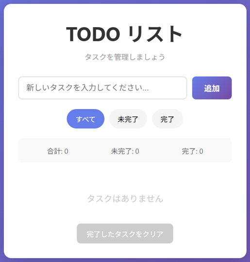

# シンプルTODOリストアプリ

バニラJavaScript、HTML、CSSで作成したシンプルで使いやすいTODOリストアプリです。ローカルストレージを使用しているため、ブラウザを閉じてもデータが保持されます。

## 🌐 ライブデモ

**[ここをクリックしてアプリを試す →](https://gigaschool.github.io/simple-todo-ja/)**

ブラウザ上ですぐに使用できます。インストール不要！

## 📸 スクリーンショット



## 🌟 機能

- ✅ **TODOの追加・削除** - 新しいタスクを簡単に追加・削除できます
- ✅ **完了/未完了の切り替え** - チェックボックスでタスクの状態を管理
- ✅ **フィルター機能** - すべて、未完了、完了済みで表示を切り替え可能
- ✅ **統計情報** - 合計、未完了、完了数をリアルタイム表示
- ✅ **一括クリア** - 完了したタスクをまとめて削除
- ✅ **ローカルストレージ対応** - ブラウザを閉じてもデータが保持される
- ✅ **レスポンシブデザイン** - PCとモバイルの両方に対応
- ✅ **スムーズなアニメーション** - 快適なユーザー体験

## 🚀 使い方

1. `index.html` をブラウザで開く
2. テキストボックスにタスクを入力して「追加」をクリック
3. チェックボックスをクリックしてタスクを完了
4. 「削除」ボタンでタスクを削除
5. フィルターボタンで表示内容を切り替え

## 📁 ファイル構成

```
simple-todo-ja/
├── index.html      # HTMLマークアップ
├── styles.css      # スタイル（グラデーション背景、レスポンシブ対応）
├── script.js       # JavaScriptロジック（状態管理、ローカルストレージ）
├── README.md       # このファイル
└── LICENSE         # MITライセンス
```

## 🛠️ 技術スタック

- **HTML5** - セマンティックマークアップ
- **CSS3** - Flexbox、グラデーション、アニメーション
- **Vanilla JavaScript** - フレームワーク不要
- **Web Storage API** - ローカルストレージ

## 💾 データ保存

このアプリはブラウザのローカルストレージを使用しており、以下のデータを保存しています：

```javascript
{
  id: タイムスタンプ,
  text: タスクのテキスト,
  completed: 完了状態（true/false）,
  createdAt: 作成日時
}
```

ブラウザのキャッシュをクリアするとデータが削除されます。

## 📱 ブラウザ対応

- Chrome / Edge（最新版）
- Firefox（最新版）
- Safari（最新版）
- モバイルブラウザ対応

## 🎨 デザイン

- グラデーション背景（紫色）
- モダンで直感的なUI
- ダークモード対応予定（将来の機能）

## 📝 ライセンス

このプロジェクトはMITライセンスの下で公開されています。詳細は [LICENSE](./LICENSE) ファイルをご覧ください。

## 🤝 貢献

改善提案やバグ報告は大歓迎です。プルリクエストやイシューを送ってください。

## 📞 お問い合わせ

質問や提案がある場合は、GitHubのIssuesでお知らせください。
